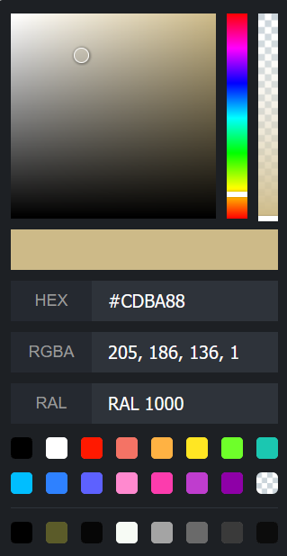

# vue-colorpicker for vHUB

This fork of vue-colorpicker now includes bidirectional conversion between HEX and RAL. If you're not familiar with the RAL colour system, you can learn more about it at this Wikipedia page https://en.wikipedia.org/wiki/RAL_colour_standard

## Preview of the component



## Install

```bash or cmd
$ npm install --save side-effects/vue-colorpicker
```

## Example

```html
<template>
    <div :style="{background: color}">
        <color-picker
            theme="light"
            :color="color"
            @changeColor="changeColor"
        />
    </div>
</template>

<script>
    import colorPicker from '@caohenghu/vue-colorpicker'

    export default {
        components: {
            colorPicker,
        },
        data() {
            return {
                color: '#59c7f9',
            }
        },
        methods: {
            changeColor(color) {
                const { r, g, b, a } = color.rgba
                this.color = `rgba(${r}, ${g}, ${b}, ${a})`
            },
        },
    }
</script>
```

## Options

| Name               | Type              | Default                                                                                                                                                                                  | Description                             |
| ------------------ | ----------------- | ---------------------------------------------------------------------------------------------------------------------------------------------------------------------------------------- | --------------------------------------- |
| theme              | String            | `dark`                                                                                                                                                                                   | `dark` or `light`                       |
| color              | String            | `#000000`                                                                                                                                                                                | `rgba` or `hex`                         |
| colors-default     | Array             | `['#000000', '#FFFFFF', '#FF1900', '#F47365', '#FFB243', '#FFE623', '#6EFF2A', '#1BC7B1', '#00BEFF', '#2E81FF', '#5D61FF', '#FF89CF', '#FC3CAD', '#BF3DCE', '#8E00A7', 'rgba(0,0,0,0)']` | like `['#ff00ff', '#0f0f0f', ...]`      |
| colors-history-key | String            | `vue-colorpicker-history`                                                                                                                                                                |

`color` is one-way data flow, so you can't use `v-model`. why? because you'll listen `changeColor` event do more things, so i think it's not necessary here.

## Events

| Name        | Type     | Args   | Description                     |
| ----------- | -------- | ------ | ------------------------------- |
| changeColor | Function | color  | `{ rgba: {}, hsv: {}, hex: ''}` |
